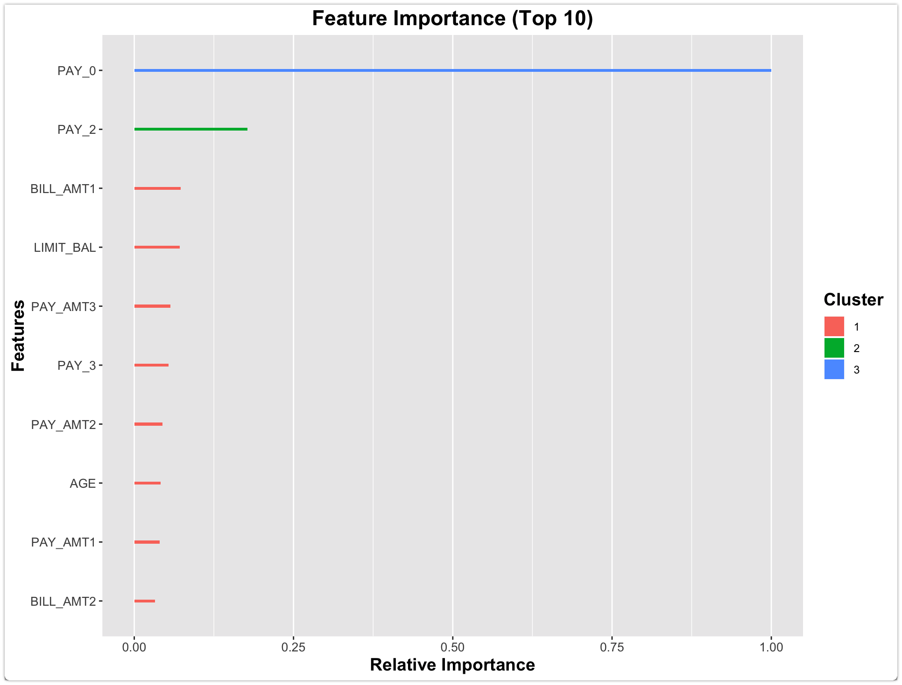
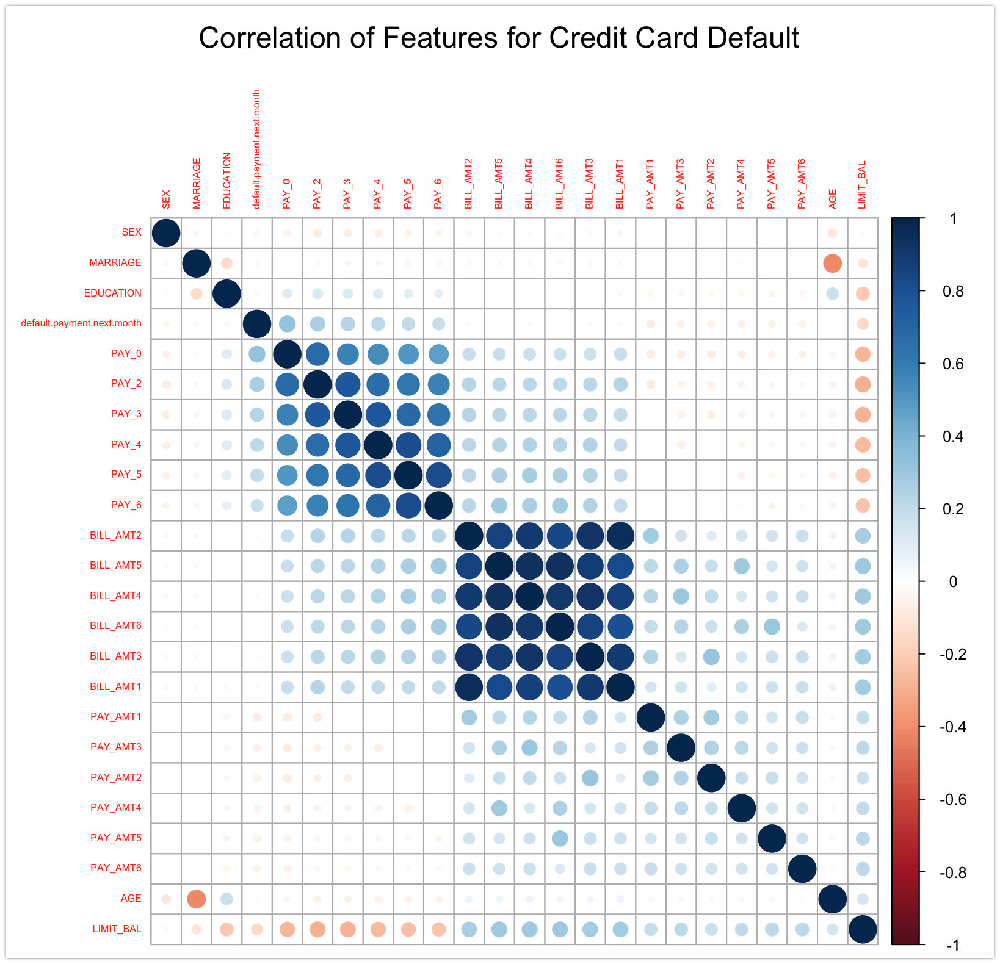

### Table 1: Error rate, Area Ratio

|Method  	               |Error rate  	|Error rate   |Area ratio   |Area ratio  |  	          
|------------------------|--------------|-------------|-------------|------------|
|  	                     |Training  	  |Validation  	|training  	  |Validation  |
|K-nearest neighbor  	   |0.189         |0.193        |0.494       	|0.502       |
|Logistic regression     |0.190        	|0.186      	|0.369       	|0.367       |
|Discriminant analysis   |0.187        	|0.187       	|0.365      	|0.375       |
|Naive Bayesian  	       |0.202        	|0.213      	|0.424      	|0.440       |
|Neural networks         |0.175        	|0.188      	|0.498       	|0.456       |
|Classification Trees    |0.179    	    |0.185       	|0.494       	|0.456       |
|Random Forest           |0.181    	    |0.186       	|0.468       	|0.458       |
|AdaBoost                |0.179    	    |0.178       	|0.515       	|0.460       |

